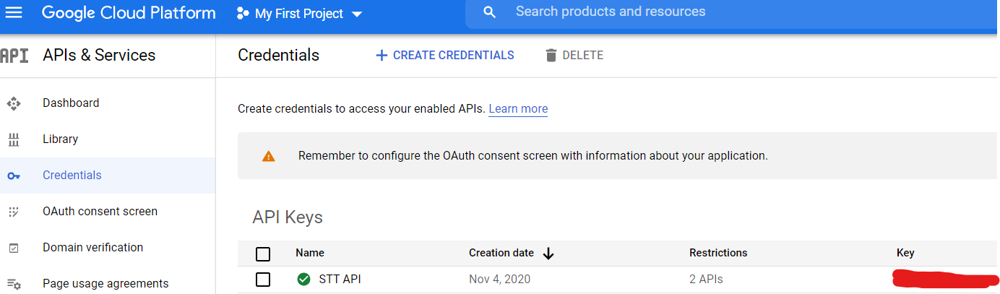
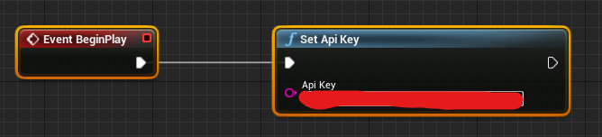
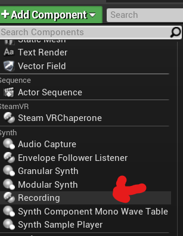
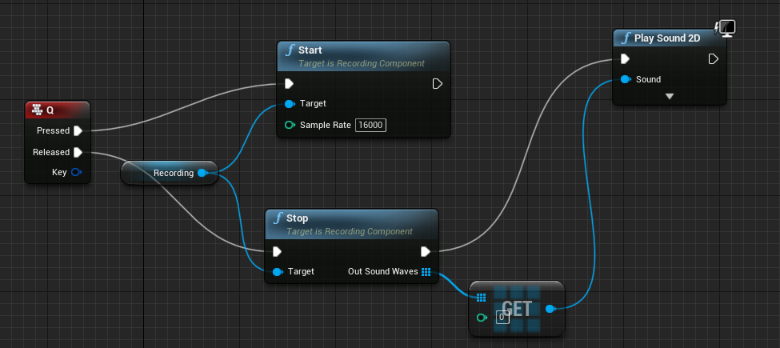
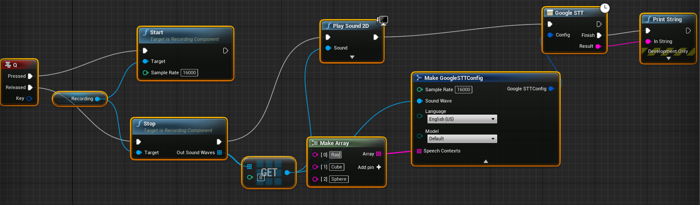

# UE4-Google-Speech-to-Text-Plugin
UE4 [Google Speech Recognition](https://cloud.google.com/speech-to-text/) Plugin including Voice Capture Function.
# Engine version and platform
Engine version: 4.25.4  
Platform: Windows 10
# Preparation
1) Follow the [instruction](https://cloud.google.com/speech-to-text/docs/quickstart-client-libraries) to set up a Cloud Console project and enable the Cloud [Speech-to-Text API](https://console.cloud.google.com/apis/library/speech.googleapis.com) for that project. 
2) Create an API key  
[Create an Api key](https://cloud.google.com/docs/authentication/api-keys)  

# How to use
1) Set Api Key



2) Add Recording Component to your actor



3) Record your speech and test your microphone



4) Set recognition configuration and send your speech to google



5) Enable exception for packaged builds

Go to your {ProjectName}.Target.cs and add this in the constructor:

```
bForceEnableExceptions = true;
bOverrideBuildEnvironment = true;
```

# Tips
* Speak no more than one minute each time.
* Capture audio with a sampling rate of 16,000 Hz or higher. And smaller sample rate will help you get the result faster (In general, 16,000 Hz is enoough).
* The SampleRate in GoogleSTTconfig should be identical with the Recording.
* You can add words, phrases or [class tokens](https://cloud.google.com/speech-to-text/docs/class-tokens) to Speech Contexts to help Speech-to-Text recognize specific words or phrases more frequently than other options that might otherwise be suggested.
* See more about config in [documentation](https://cloud.google.com/speech-to-text/docs/reference/rest/v1/RecognitionConfig).
# Thanks
[CPP Rest SDK](https://github.com/microsoft/cpprestsdk)
